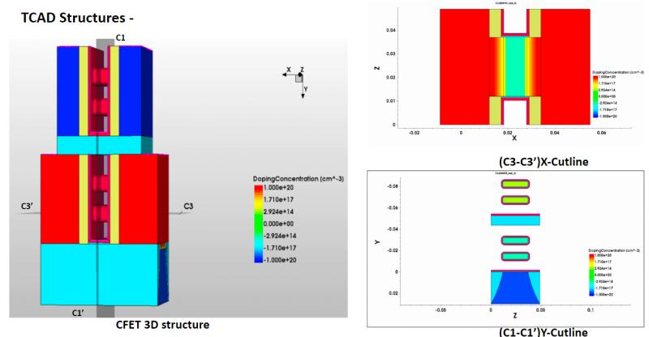

# Jaisingh Pal

#### Technical Skills: Sentaurus TCAD, cadence virtuoso, Device Characterization, Analog Circuit Design, EasyExpert, Velox, MATLAB

## Education
- Ph.D, Semiconductor Devices | IIT Gandhinagar (_Pursuing _)								       		
- B.Tech, Eletronic and Telecommunication	| VIIT Pune (_June 2022_)	 			        		
- Diploma, Eletronic and Telecommunication| Sandip Polytechnic (_May 2019_)

## Work Experience

**Lab Admin @ wafer characterization Lab (_July 2022 - Present_)**
- In our Characterization lab, we boast a state-of-the-art wafer station equipped with world-class technology. Our characterization process is enhanced by high-quality wafers, ensuring precise and reliable results. Additionally, we utilize SMu (Source Measure Unit) for comprehensive support in conducting accurate measurements throughout the characterization process.
  
**Research And Teaching Assistant @ Course ES 116 (_Jan 2024 - May 2024 (4 months)_)**
- As a teaching assistant, I have successfully fulfilled responsibilities such as conducting tutorials, assisting with labs and projects, and ensuring fair and thorough grading in my assigned courses.

**Research And Teaching Assistant @ Course FP 602 (_July 2024 - Dec 2024 (4 months)_)**
- The FP 602 TA supports the instructor by leading tutorials, grading assignments, and aiding student understanding. Knowledgeable and approachable, they foster a positive learning environment, handling administrative tasks for effective communication.

**Project Intern @ SARVAA RESEARCH AND INNOVATION PRIVATE LIMITED (_May 2021 - Nov 2021 (7 months)_)**

**Project Intern @ E-smart(_May 2018 - Jun 2018 (2 months)_)**

## Projects
### 2D Simulation of HeteroSructure Bipolar Transistor (HBT)

1. Heterojunction Bipolar Transistor (HBT): HBT is a type of bipolar junction transistor (BJT) that incorporates heterojunctions – interfaces between different semiconductor materials – in its structure.
It is widely used in high-frequency and high-speed applications due to its superior performance compared to traditional BJTs.

2. 2D Structure in TCAD: In TCAD simulations, the 2D structure of an HBT is represented using a graphical interface to model the physical layout and material composition.
The simulation involves creating layers that represent the different semiconductor materials and their properties, including bandgap energies and carrier mobilities.

3. Emitter-Base-Heterojunction: The core of the 2D structure involves the emitter, base, and collector regions, with particular attention to the heterojunctions formed at the emitter-base and base-collector interfaces.

4. The heterojunctions play a critical role in enhancing the transistor's performance by facilitating efficient electron or hole injection across the junctions.

### 3D Simulation based study of Complementary FET

1. Dual-Type Transistor Integration: CFETs integrate both n-type and p-type transistors on a single semiconductor substrate. This dual-type configuration enables improved power efficiency and reduced heat dissipation, addressing some of the challenges associated with traditional FET designs.

2. Enhanced Power Efficiency: By combining the strengths of n-type and p-type transistors, CFETs facilitate efficient switching between high and low states, resulting in reduced power consumption and enhanced overall energy efficiency. This makes CFETs particularly appealing for applications where power efficiency is critical.

3. Improved Performance Metrics: The complementary nature of CFETs contributes to improved speed, reduced leakage currents, and enhanced noise margins compared to conventional transistor configurations. These attributes make CFETs well-suited for high-performance applications in various electronic devices.

4. Potential for 3D Integration: CFETs hold the potential for seamless integration into three-dimensional (3D) architectures, paving the way for compact and highly efficient semiconductor devices. This feature aligns with the industry's pursuit of miniaturization and improved chip density.

### Radiation-Hardened 14T SRAM Bitcell With Speed and Power Optimized for Space Application.

1. Radiation-Hardened Electronics: Proven expertise in implementing robust design methodologies, hardened materials, and redundancy techniques to enhance the radiation tolerance of semiconductor devices.

2. 14T SRAM Bitcell Design: Specialized in crafting efficient 14T SRAM bitcells, with a focus on optimizing speed and power characteristics to meet the stringent requirements of space missions.

3. Low-Power Design: Proficient in employing low-power design methodologies to minimize energy consumption, ensuring reliable and sustainable operation in space applications.

### Analog Circuit Design

1. Designed a Low Power 2-Stage OP-AMP:
 - Developed a low-power 2-stage Operational Amplifier (OP-AMP) with specific design specifications.
 - Executed the design in the SCL 180nm technology node, emphasizing power efficiency.

2. Band-Gap Reference Circuit Design:
 - Engineered a Band-Gap Reference circuit capable of temperature compensation over a range of -40°C to 125°C.
 - Achieved a supply voltage regulation of 10mV across different process corners in the SCL 180nm technology node.

3. Configurable Amplifiers Design and Analysis:
 - Designed and analyzed various amplifier configurations to explore performance characteristics.
 - Explored configurations such as CS-CS cascade, telescopic cascode, gain-boosted, folded cascode, and Operational Transconductance Amplifier (OTA).
 - Conducted detailed analysis to understand the strengths and weaknesses of each amplifier configuration in the SCL 180nm technology node.

### Paper Review on 3D NAND Flash.

1. Vertical Stacking for Higher Density:
 - 3D NAND Flash memory uses a vertical stacking architecture, allowing for multiple layers of memory cells.
 - This vertical stacking increases the storage density of the memory, enabling higher capacities in a smaller physical space.

2. Improved Performance:
 - Compared to traditional planar NAND, 3D NAND offers enhanced read and write speeds.
 - The reduced electron travel distance in the vertical structure contributes to faster data access times, improving overall performance.

3. Enhanced Endurance and Reliability:
 - Advanced error correction algorithms and wear-leveling techniques are implemented in 3D NAND.
 - These features contribute to better endurance and reliability by evenly distributing write and erase cycles across the memory cells.

4. Cost Efficiency and Future Trends:
 - While initial manufacturing costs may be higher, the increased storage density and performance often result in better cost efficiency (price per gigabyte).
 - Ongoing research aims to further advance 3D NAND technology, focusing on increasing the number of layers, refining manufacturing processes, and optimizing overall performance for future applications.

### Paper Review on Silicon-Germanium Heterojunction Bipolar Transistor.

1. SiGe HBT Fabrication Techniques:
 - Exploration of various epitaxial growth methods for SiGe layers.
 - Precision control over material properties and integration with silicon for heterojunction formation.

2. Device Physics and Performance Metrics:
 - In-depth analysis of SiGe HBT operation principles.
 - Examination of key performance parameters, including current gain, cutoff frequency, and noise characteristics.

3. **Material Considerations:**
 - Discussion on the challenges and advancements in material engineering.
 - Integration of SiGe with silicon and other materials to optimize device performance.

4. Applications in High-Frequency Electronics:
 - Overview of current applications in communication systems and radar.
 - Exploration of SiGe HBT's potential in emerging high-frequency electronic devices.

5. Future Outlook and Ongoing Research:
 - Insights into ongoing research directions in SiGe HBT technology.
 - Consideration of novel material combinations and their impact on future applications.

## Volunteering
- Volunteer: I dedicated my time to volunteering for management and assistance at EDTM 2024, actively contributing to the seamless execution of the event. Coordinating tasks and providing support, I played a crucial role in ensuring its smooth functioning. - Edtm 2024

## Publications and conference proceedings
1. Prateek sharma, **Jaisingh Pal**, & Lashkare, S. (2024). Capacitor-less Silicon-on-Insulator MOSFETs for Bit-wise Logical Operations in In-memory Computing. In Proceedings of the IEEE EDTM 2024. Bangalore, India

